# Deep Learning Model with two outputs

## Project Description
In this Work we have a Dataset of a pipe under water and we want to know create a model that can Predict the pipe orientation and the sign of that orientation, so we are in a situation where we have to build a multi output model where it can Predict sign and orientation in the same time

## Project Dataset
|Image 1|Image 2 | Image 3|Image 4| Image 5|Image 6|
|---|---|---|--|--|--|
|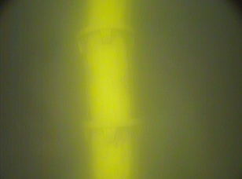||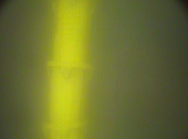|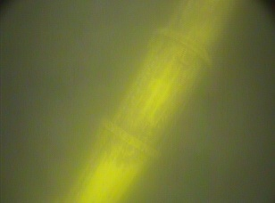|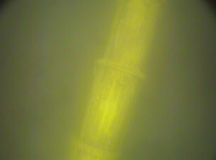|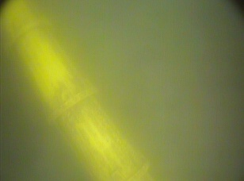|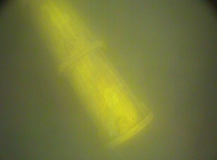||

## Models Results

## orientation model Results
Based on **VGG16** architecture

|Orientaion loss|Orientation Mean absolute Error|
|--|--|
|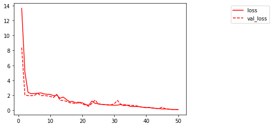|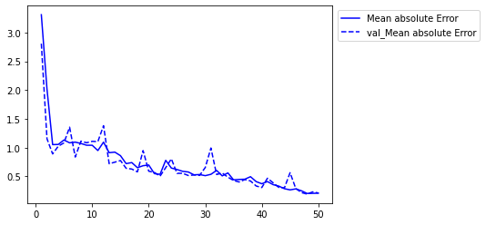|

## sign model Results

|sign loss| sign Accuracy|
|--|--|
|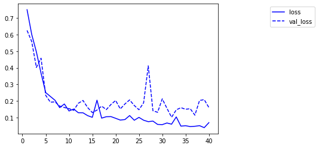|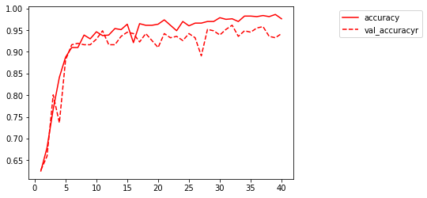|

## Hybrid model Results

|Hybrid model losses| Hybrid model accuracy & MAE|
|--|--|
|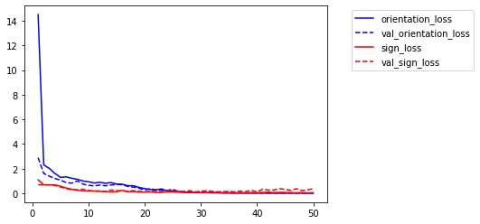|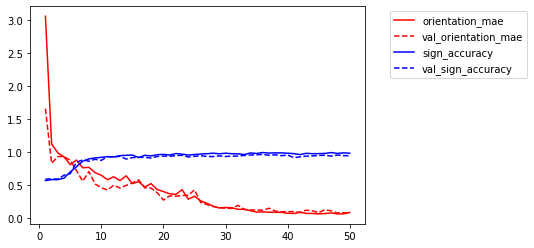|
